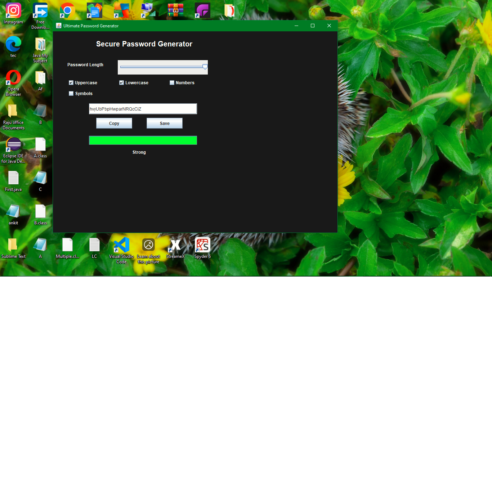

# Ultimate Password Generator

A simple and powerful password generator built using Python. This project helps users create strong, random, and secure passwords based on their chosen preferences such as length, uppercase letters, lowercase letters, numbers, and special characters.

## Features

- Generate strong and secure passwords
- User-defined password length
- Option to include:
  - Uppercase letters
  - Lowercase letters
  - Numbers
  - Special characters
- Easy-to-use interface
- Fast and lightweight program
- Helpful for improving account security

## Purpose of the Project

The main purpose of this project is to generate secure passwords that are difficult to guess or crack. It is useful for protecting online accounts, email IDs, social media accounts, banking apps, and other digital platforms.

## Technologies Used

- Python
- Random module
- String module
- Tkinter (if GUI version is used)

## How It Works

The program asks the user to enter the desired password length and select which types of characters should be included in the password. Based on the selected options, it randomly generates a password and displays it to the user.

## Example

Example of a generated password:

## Output Screenshot

